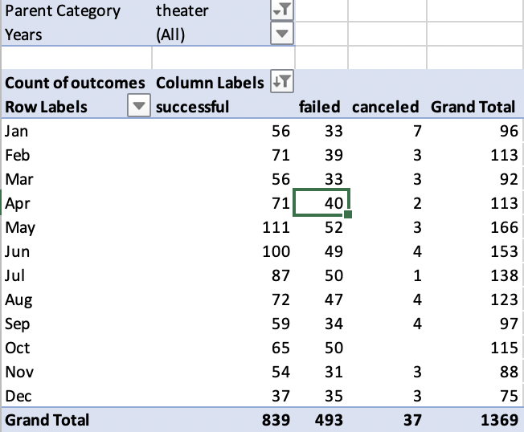
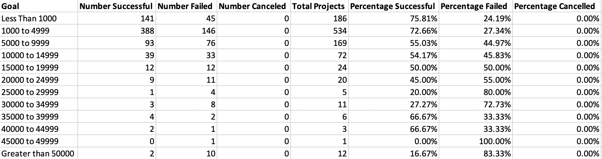

# Kickstarting with Excel

## Overview of Project

### Purpose

The purpose of analysis was to help Louise understand Kickstarter campaign data for her own play's fundraiser. I visualized campaign outcomes based on their goals and launch dates, helping Louise understand when to start her campaign and how much her goal should be.

## Analysis and Challenges

### Analysis of Outcomes Based on Launch Date

For launch date analysis, I created a Pivot Table in Excel to collect data on theater fundraisers based on the month of launch date as well as whether they succeeded, failed, or were canceled. I then plotted that data into a line chart with each line representing a success/failure/cancel. 

### Analysis of Outcomes Based on Goals

For goal analysis, I performed a count of the number of successful, failed, and cancelled play campaigns. Each count was divided based on the goal of the campaign ranging from "less than $1000" to "greater than 50000" with $5000 intervals in between. After doing this, I took the percentage of each category and plotted them in a line chart with each line representing a success/failure/cancel.

### Challenges and Difficulties Encountered

Some of the challenges in doing the analysis came from implementing new functions I never used in Excel like the COUNTIFS() function. Otherwise, the analysis was pretty self-explanatory and used methods I've worked with before.

## Results

- What are two conclusions you can draw about the Outcomes based on Launch Date?

The two conclusions we can make are that there is a high percentage of successful campaigns in May and that winter campaigns are generally less successful.

- What can you conclude about the Outcomes based on Goals?

We can see there are some ranges where a campaign is more likely to fail, like more than $45000 or around $20000 to $30000. Generally, the less a campaign's goal is, the more successful it might end up (though there are exceptions like the before mentioned).

- What are some limitations of this dataset?

This information is only from Kickstarter, meaning it is not getting data from other fundraising sources like GoFundMe that could give different data.

- What are some other possible tables and/or graphs that we could create?

We could plot the percentage funded for other variables such as month of campaign to confirm if it lines up with the first plot. 
